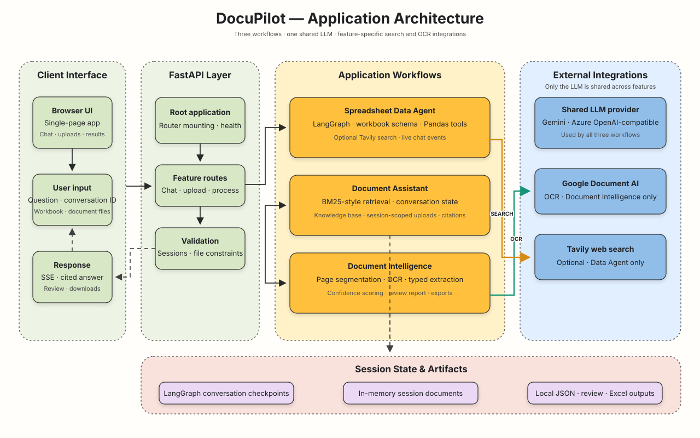
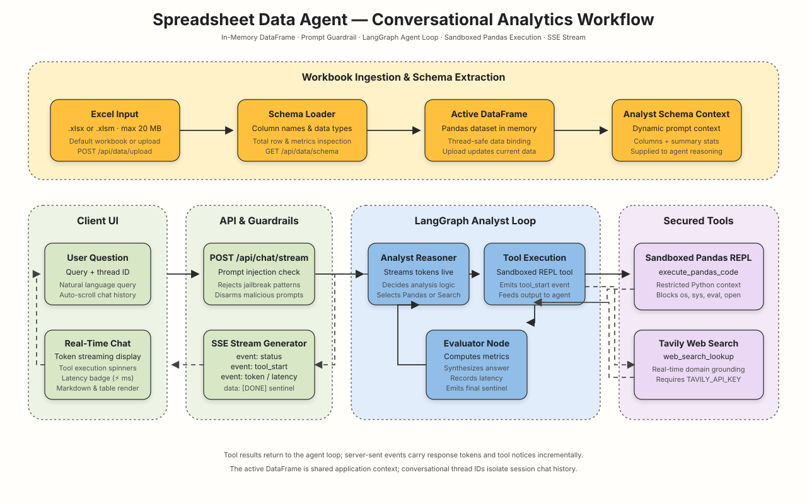
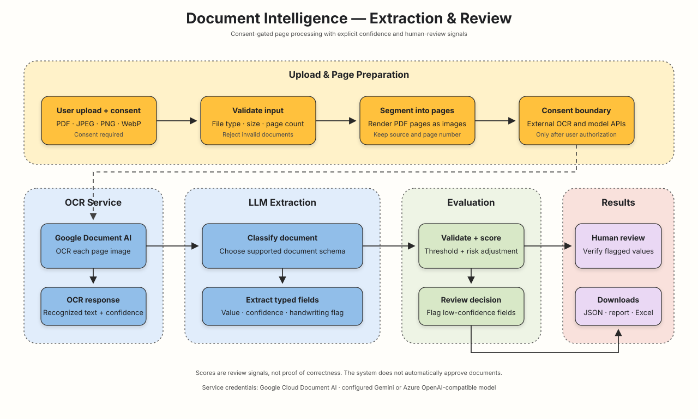

# DocuPilot

DocuPilot is a web application for spreadsheet analysis, evidence-based document
support, and document data extraction. It uses one FastAPI server, a shared
Gemini/Azure OpenAI-compatible model configuration, and a single browser UI.

## Architecture



## Features

### Spreadsheet Data Agent

Upload an `.xlsx` or `.xlsm` workbook and ask questions about its data. The
agent uses a LangGraph workflow to reason over the active workbook, run
Pandas-backed analysis, and optionally search the web with Tavily. Replies are
streamed to the browser using server-sent events. Uploading another workbook
replaces the active dataset for the application.



### Document Assistant

Ask questions about application knowledge or consented session documents. The
assistant retrieves relevant text with a lightweight BM25-style keyword ranker
and cites its sources. Uploaded documents are isolated by conversation ID,
held in process memory, and removed when the session is deleted or the app
restarts.

Supported user uploads are PDF, DOCX, and UTF-8 TXT. PDFs must contain a text
layer; this feature does not perform OCR.

### Document Intelligence

Upload PDFs or images to extract structured fields from identity, insurance,
and related documents. The pipeline segments documents into pages, uses Google
Cloud Document AI for OCR, then uses the configured LLM for classification and
field extraction. Confidence scoring and validation flag results for human
review. JSON, review-report, and Excel files are available for download.

Processing requires explicit consent before pages are sent to configured
external OCR and AI providers. Extracted information is not independently
verified and must be reviewed before use.



## Quick start

Use Python 3.12 and run these commands from the repository root:

```bash
python -m venv .venv
source .venv/bin/activate
python -m pip install -r requirements.txt
```

Create a `.env` file in the repository root. For Gemini, start with:

```dotenv
AI_PRIMARY_PROVIDER=gemini
GEMINI_API_KEY=replace-with-your-api-key
GEMINI_MODEL=gemini-3.6-flash
```

Set the required values for your chosen provider and services, then start the server:

```bash
python main.py
```

Open [http://localhost:8000](http://localhost:8000).

On Windows PowerShell, activate the environment with:

```powershell
.\.venv\Scripts\Activate.ps1
```

## Configuration

### Language model provider

Choose Gemini or Azure OpenAI-compatible service with
`AI_PRIMARY_PROVIDER=gemini` or `AI_PRIMARY_PROVIDER=azure`. The legacy
`TRACEROOT_PROVIDER` setting is accepted if `AI_PRIMARY_PROVIDER` is unset.

| Provider | Environment variables |
| --- | --- |
| Gemini | `GEMINI_API_KEY`, optional `GEMINI_MODEL` |
| Azure | `AZURE_OPENAI_BASE_URL`, `AZURE_OPENAI_API_KEY`, `AZURE_OPENAI_MODEL` |
| Azure AI Foundry aliases | `AZURE_FOUNDRY_ENDPOINT`, `AZURE_FOUNDRY_API_KEY`, `AZURE_FOUNDRY_MODEL` |

Azure CLI authentication is also supported. Set
`AZURE_OPENAI_AUTH_MODE=azure-cli`, configure the Azure endpoint and model, and
sign in with `az login` in the environment running the application. The signed
in identity must have permission to invoke the Azure OpenAI resource. API-key
authentication is the default.

Gemini uses its Google OpenAI-compatible API endpoint. Azure endpoints can be
configured as a resource root or an OpenAI-compatible base URL.

### Other services

| Feature | Environment variables |
| --- | --- |
| Web search | `TAVILY_API_KEY` |
| Google Cloud Document AI | `GCP_PROJECT_ID`, `GCP_LOCATION`, `DOCAI_PROCESSOR_ID`, `GOOGLE_APPLICATION_CREDENTIALS` |
| Workbook override | `EXCEL_FILE_PATH` |
| Field confidence | `FIELD_CONFIDENCE_THRESHOLD` (default `0.85`) |
| Handwriting penalty | `HANDWRITTEN_CONFIDENCE_PENALTY` (default `0.20`) |

Keep API keys and service-account files private. Do not commit `.env` or
credential files.

## API routes

| Route | Purpose |
| --- | --- |
| `GET /api/health` | Server health |
| `GET /api/data/schema` | Active workbook schema |
| `POST /api/data/upload` | Upload an Excel workbook |
| `POST /api/chat/stream` | Stream Data Agent replies with tool execution and latency (SSE) |
| `POST /api/document-assistant/chat` | Ask the Document Assistant (synchronous) |
| `POST /api/document-assistant/chat/stream` | Stream Document Assistant replies with citations and step updates (SSE) |
| `POST /api/document-assistant/documents` | Add session-scoped evidence |
| `DELETE /api/document-assistant/session/{thread_id}` | Remove session evidence and conversation |
| `GET /api/documents/settings` | Report active AI providers, models, endpoints, and safety thresholds |
| `POST /api/documents/process` | Process consented PDF/image uploads (synchronous) |
| `POST /api/documents/process/stream` | Stream real-time progress events and results for consented uploads (SSE) |
| `GET /api/documents/{job_id}/{filename}` | Download job artifacts (`documents.json`, `review_report.json`, `documents.xlsx`) |
| `GET /api/documents/{job_id}/evaluation.json` | Job evaluation matrices (`quality`, `routing`, `throughput`) |

The application supports pure **OpenAI** (with custom base URLs like Ollama, vLLM, DeepSeek, or Groq), **Google Gemini**, and **Azure OpenAI**. See `.env.example` for all configuration variables.

The application does not currently provide user authentication. Treat
conversation IDs as identifiers, not as access control.

## Performance & Evaluation Framework

DocuPilot includes built-in latency tracking and evaluation matrices (inspired by DevDocs-AI patterns):
- **Latency Tracking**: Measured across every pipeline stage (segmentation, OCR/processing, grouping, review, export), API endpoints (`X-Latency-Ms` header), SSE events, and rendered in the frontend.
- **Evaluation Matrices**:
  1. *Pipeline Quality Matrix*: Average classification confidence, field confidence distribution, and validation pass rates.
  2. *Throughput Matrix*: Stage-by-stage latencies, pages per second, and total processing duration.
  3. *Routing Matrix*: Automated processing rate vs. human review flags broken down by trigger reason.

## Document Pipeline Verification & Known Failure Modes

Live end-to-end verification against real test assets (`data/Question3/`) confirms how the pipeline handles edge cases, low confidence scores, and unsupported documents:

| Category | Observed Behavior / Asset | Pipeline Resolution |
| :--- | :--- | :--- |
| **Unsupported Document Type** | `Proposal Ashok.pdf` (Page 1)<br>`Assignment Ashok.pdf` (Pages 1 & 2) | Classified as `UNKNOWN`. Not present in the 10 supported schemas; logged in `review_report.json` under `flagged_fields` with reason `"Unsupported or unknown document type: UNKNOWN"` and marked for human review without failing the batch job. |
| **Handwriting Confidence Penalty** | `ECS.jpeg` (`NACH_MANDATE`) | Hand-filled fields (`bank_account_number`, `ifsc_code`, `frequency`) receive the configured handwriting penalty (0.20) and score below the 0.85 threshold; flagged in `review_report.json` and routed to `HUMAN_REVIEWS_REQUIRED`. |
| **Partial / Incomplete Form** | `Proposal Ashok.pdf` (Page 2 - `MORAL_HAZARD_QUESTIONNAIRE`) | Page-level classification confidence (0.75) is below threshold (0.85); flagged with reason `CLASSIFICATION_BELOW_CONFIDENCE_THRESHOLD`. |
| **OCR Provider Failover** | Azure DI DNS unreachable or GCP DocAI billing disabled | Automatically cascades: Azure DI → Google DocAI → Vision LLM fallback. OCR confidence is reported as unavailable or derived from fallback, with pipeline completing successfully. |

## Tests

Run the offline test suite from the repository root:

```bash
python -m unittest discover -s tests -t . -v
```

Tests use mocked external services and do not send local documents to model or
OCR providers.
